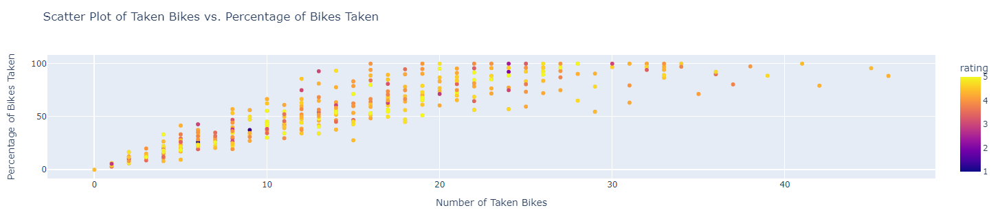

# Final-Project-Statistical-Modelling-with-Python

## Project/Goals
The goal of this project was to see if there was a correlation between bikes available at CityBikes stations and ratings of Points of Interest (POI). Specifically, I aimed to retrieve all POIs within a 1000m radius of CityBikes stations within Barcelona, and analyzed the relationship between ratings of the POIs and ubike usage, and evaluated which API between Yelp and Foursquare gave more comphrensive data for a specific region.

## Process
### Step 1: Data Collection
- I used the CityBikes API to retrieve bike information, including available bikes, free slots and coordinates for each station.
- The Foursquare and Yelp APIs were compared to gather POI data within a 1000m radius of bike stations.
- Data from the CityBikes and Yelp API were stored in DataFrames, which were merged together to explore the relationship between bike usage and POIs.
### Step 2: Data Cleaning, Preparation and EDA
- I cleaned the Yelp data to ensure consistency and removed duplicates caused by repeated POIs near multiple bike stations.
- The merged dataset cointained around 395,780 rows, including columns for coordinates, POI data and bike availability metrics.
- I visualized the relationships between columns such as ratings and bike availability using `plotly`. 

### Step 3: Data Analysis and Modelling
- After merging the CityBikes and POI data, I attempted to explore the relationship between POI ratings and bike usage using LinearRegression for `scikit-learn` (was initially supposed to be `statsmodels` but after receiving multiple kernel failures I had to opt for scikit-learn).
## Results
The regression model's low R-squared value suggests a weak correlation between POI ratings and bike usage. This indicates that while there may be some relationship, other factors likely influence bike station activity more significantly than POI popularity alone. In hindsight, it would've been better to use a correlation between amount of ratings rather than ratings itself.

## Challenges 
- **API Integration**: Managing the integration of three different APIs proved to be very challenging, especially figuring out how to merge the datasets.
- **Data Size**: The merged dataset was very large, which initially caused many kernel crashes, especially when it came to visualization and modelling, both which were resolved by sampling and opting for different modules.
- **Data Overlap**: Multiple POIs were near multiple bike stations, which caused duplication issues, requring careful cleaning to maintain accuracy.

## Future Goals
- **Model Optimization**: I would try other machine learning models apart from regression to see if any other insights can be found through the merged dataset.
- **Interactivity**: I would try to allow for any cities data to be pulled with ease by just changing a variable name (done for city_bikes.ipynb but no other notebook)
- **Gather More Insights**: I would try to see if any other relationships between data was there apart from what I already attempted.
